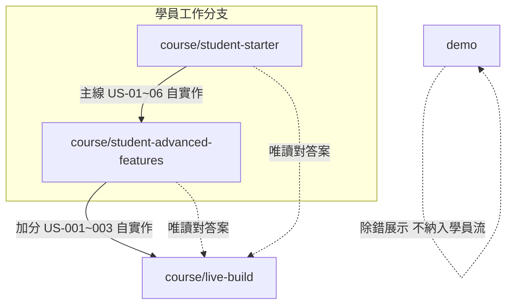

# 課程分支建立計畫

## 目標架構



| 分支 | 程式 | 文件 | migration |
|------|------|------|-----------|
| [`course/student-starter`](course/student-starter) | 工具鏈 + 可 build 空殼 | `spec` + `user-stories` + `line-push`（**AC 全 `[ ]`**） | **無** |
| [`course/student-advanced-features`](course/student-advanced-features) | **主線 MVP 完整**；**無** LINE/Cron 實作 | 主線 US **全 `[x]`**；`line-push` US **`[ ]`** | **無** |
| [`course/live-build`](course/live-build)（`89f3687`，不修改邏輯） | 完整解答（含 LINE、Cron、migration） | 教師用；可保留 US-03 驗收說明 | **有** |
| `demo` | 不變 | 除錯情境 | — |

**你的決策已納入：** advanced 主線 AC 全部 `[x]`；本次包含 [`scripts/bootstrap-course-branches.mjs`](scripts/bootstrap-course-branches.mjs)。

---

## Phase 0：鎖定基準與不動範圍

- **基準 commit：** 現有 [`course/live-build`](course/live-build) @ `89f3687`（含 [`lib/line.ts`](lib/line.ts)、[`app/api/test-line/route.ts`](app/api/test-line/route.ts)、[`lib/cron-auth.ts`](lib/cron-auth.ts)、[`vercel.json`](vercel.json) crons、[`supabase/migrations/001_create_watchlist.sql`](supabase/migrations/001_create_watchlist.sql)）。
- **不修改** `course/live-build` 程式（除非發現 build 壞掉；預期維持現狀）。
- **不修改** `demo` 分支。
- 遠端 [`feat/advanced-features`](feat/advanced-features)：在 [`docs/COURSE-BRANCHES.md`](docs/COURSE-BRANCHES.md) 標記 **deprecated**，指向 `course/student-advanced-features`（不強制刪遠端分支，避免破壞他人連結）。

---

## Phase 1：新增課程說明文件

建立 [`docs/COURSE-BRANCHES.md`](docs/COURSE-BRANCHES.md)，內容包含：

- 四分支對照表（用途、學員是否應 checkout）
- 建議學習路徑：starter → advanced →（對答案）live-build
- **無 migration 政策**：US-02 建表請對照 `origin/course/live-build:supabase/migrations/...`
- 對答案指令範本：
  - `git fetch origin course/live-build`
  - `git show origin/course/live-build:path`
  - `git worktree add ../stock-answer origin/course/live-build`
- GitHub 建議（教師手動）：Default branch = `course/student-starter`；`course/live-build` branch protection（僅 maintainers push）

同步修正 [`docs/line-push-vercel-cron/user-stories/README.md`](docs/line-push-vercel-cron/user-stories/README.md) 第 29 行：將 `docs/init-project-features` 改為 `docs/user-stories` 主線。

---

## Phase 2：建立 `scripts/bootstrap-course-branches.mjs`

單一腳本，支援子命令（避免日後手動漏檔）：

```bash
node scripts/bootstrap-course-branches.mjs starter    # 重生 student-starter
node scripts/bootstrap-course-branches.mjs advanced   # 從 live-build 剝加分 → student-advanced-features
node scripts/bootstrap-course-branches.mjs --dry-run  # 可選：只列將刪/將改檔案
```

### `starter` 行為

1. 以 `course/live-build` 為**文件來源**（copy docs），程式用**內建白名單**寫入乾淨 tree（或 `git checkout --orphan` 後覆寫）。
2. **保留：**
   - 工具鏈：`package.json`、`package-lock.json`、`tsconfig.json`、`eslint.config.mjs`、`postcss.config.mjs`、`next-env.d.ts`
   - [`.env.example`](.env.example)
   - 最小 App：[`app/layout.tsx`](app/layout.tsx)、[`app/globals.css`](app/globals.css)、[`app/page.tsx`](app/page.tsx)（引導頁：說明從 US-01 開始、連結 `docs/user-stories/US-01.md`）、`app/favicon.ico`
   - 文件：[`docs/spec.md`](docs/spec.md)、[`docs/user-stories/`](docs/user-stories/)、[`docs/line-push-vercel-cron/`](docs/line-push-vercel-cron/)、[`docs/design.pen`](docs/design.pen)（若存在）
   - [`docs/COURSE-BRANCHES.md`](docs/COURSE-BRANCHES.md)
3. **刪除：** `app/api/**`、`app/actions/**`、`components/**`、`hooks/**`、`lib/**`、`types/**`、`middleware.ts`、`supabase/**`、`vercel.json`（或無 crons 的精簡版）、其他非課程 docs（`init-project-features`、`line-chart-optimization`、`ui-redesign`、`debug-scenarios`、`design-sample` 等）。
4. **文件處理：**
   - `docs/user-stories/US-01.md`～`US-06.md`：所有 `- [x]` → `- [ ]`
   - 刪除 [`docs/user-stories/US-03.md`](docs/user-stories/US-03.md) 內 `#### 驗收說明` 起至檔尾（或整段區塊）
   - `line-push` US 維持 `[ ]`

### `advanced` 行為

1. 從 `course/live-build` checkout 新分支 `course/student-advanced-features`。
2. **刪除檔案：**
   - [`lib/line.ts`](lib/line.ts)
   - [`app/api/test-line/route.ts`](app/api/test-line/route.ts)（整目錄）
   - [`lib/cron-auth.ts`](lib/cron-auth.ts)
   - [`supabase/`](supabase/) 整目錄
3. **修改檔案：**
   - [`lib/stock-notification.ts`](lib/stock-notification.ts)：移除 `sendLineText`、`isLineEnabled`、多管道並行；改為 **僅 Telegram**（保留 `buildTargetPriceAlertMessage`、`sendTargetPriceNotifications` 語意與 spec 一致）。
   - [`app/api/check-prices/route.ts`](app/api/check-prices/route.ts)：移除 `GET`、`isCronAuthorized`；**只保留 POST** 給前端輪詢。
   - [`vercel.json`](vercel.json)：移除 `crons` 陣列（保留 framework/buildCommand）。
4. **文件處理：**
   - 主線 US-01～06：全部 AC → `[x]`
   - 刪除 US-03「驗收說明」區塊（避免在學員分支漏長答案）
   - `line-push` US-001～003：維持 `[ ]`
   - 更新 `line-push/README.md` 前置說明（同 Phase 1）
5. [`.env.example`](.env.example)：**保留** `LINE_*`、`CRON_SECRET` 欄位與註解（加分作業用）。

### 腳本安全

- 拒絕在 `course/live-build` 上執行 destructive 操作
- 執行後於目標分支跑 `npm run typecheck && npm run build`

---

## Phase 3：執行分支建立並推送

| 步驟 | 動作 |
|------|------|
| 1 | `git checkout course/live-build` 確認乾淨 |
| 2 | `node scripts/bootstrap-course-branches.mjs starter` → 提交 `course/student-starter` |
| 3 | `node scripts/bootstrap-course-branches.mjs advanced` → 提交 `course/student-advanced-features` |
| 4 | `git push -u origin course/student-starter course/student-advanced-features` |
| 5 | 本地驗證：分別 checkout 兩分支跑 build |

**Commit 訊息建議（各一 commit）：**

- `chore(course): add student-starter branch for mainline exercises`
- `chore(course): add student-advanced-features without LINE/Cron impl`

---

## Phase 4：驗收清單（實作後必跑）

### `course/student-starter`

- [ ] `npm run build` / `typecheck` 通過
- [ ] 無 `lib/`、`components/`、`app/api/` 業務檔
- [ ] 無 `supabase/migrations`
- [ ] US-01～06 全為 `[ ]`；無「驗收說明」
- [ ] `app/page.tsx` 僅引導，無 Yahoo/Supabase import

### `course/student-advanced-features`

- [ ] `npm run build` / `typecheck` 通過
- [ ] 無 `lib/line.ts`、`test-line`、`cron-auth`；`check-prices` 僅 POST
- [ ] `vercel.json` 無 crons
- [ ] 主線 US 全 `[x]`；`line-push` US 全 `[ ]`
- [ ] 無 `supabase/`
- [ ] `git diff course/student-advanced-features..course/live-build` 顯示預期差異（LINE/Cron/migration）

### `course/live-build`

- [ ] 未被腳本改寫（`git diff course/live-build` 為空）

---

## Phase 5：GitHub / 課程營運（需你手動）

- 將 **Default branch** 設為 `course/student-starter`
- 為 `course/live-build` 設定 **branch protection**（限制 push）
- 課程簡報加一頁：分支表 +「對答案請用 worktree，勿在 live-build 開發」

---

## 風險與緩解

| 風險 | 緩解 |
|------|------|
| 剝 LINE 後殘留 import 導致 build 失敗 | bootstrap 後強制 typecheck；`stock-notification` 單元邏輯先寫死 Telegram-only |
| 學員誤 clone 到 live-build | Default branch + COURSE-BRANCHES 醒目說明 |
| US-02 無 migration 卡住 | 文件指向 live-build SQL；技術備註欄位表仍在 US-02 |
| 腳本誤改 live-build | 腳本內 branch guard + 僅允許目標分支名 |

---

## 不在本次範圍

- 修改 `course/live-build` 的 US-04 文件 `[ ]` 與程式同步（可另開教師維護 PR）
- 修正 migration 內 `^\d+\.TW$` 與多市場代號（僅影響解答分支參考品質）
- 刪除遠端 `feat/advanced-features`
- 自動化 GitHub branch protection（需 repo 權限）
